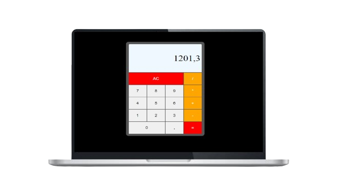

<h1 align="center">
  Calculator
</h1>

  

## ✨ Tecnologias

Esse projeto foi desenvolvido com as seguintes tecnologias:

- [Svelte Kit](https://kit.svelte.dev/)
- [TailwindCSS](https://tailwindcss.com)
- [JavaScript](https://developer.mozilla.org/pt-BR/docs/Web/JavaScript)
- [Vite](https://vitejs.dev)

## 💻 Projeto

O Calculator é um app de calculadora. É permitido realizar contas de multiplicação, divisão, soma e subtração.

## 🔖 Acesso

[Calculator](https://calculator-1a1a.netlify.app)

## 🚀 Como executar

- Clone o repositório
- Instale as dependências com `npm install`
- Inicie o servidor com `npm run dev`

Agora você pode acessar [`localhost:5173`](http://localhost:5173) do seu navegador.

---
